# Genetic Algorithm For Image Puzzle

## 1. Introduction
- In this homework, we are going to solve the image puzzle problem using genetic algorithm. The image puzzle problem is a problem where, given an image, we need to divide it into several pieces and shuffle them. 

- The goal is to reconstruct the original image by moving the pieces and putting them in the correct order. We will create a genetic algorithm to solve this problem and apply it to the image puzzle problem.

- A genetic algorithm consists of several steps. First, we need to create an initial population of solutions. Then, we evaluate the fitness of each solution in the population. Next, we select the best solutions to be parents of the next generation. We then apply genetic operators such as crossover and mutation to create new solutions. Finally, we replace the old population with the new population and repeat the process until we find a solution that satisfies the termination condition.

## 2. Problem Setup
- In this problem, we will use a patch size of *32x32*, which is essentially calculated as follows based on what number of patches i want:

$$
\text{total\_pixels} = \text{height} \times \text{width}
$$

$$
\text{patch\_area} = \frac{\text{total\_pixels}}{\text{num\_patches}}
$$

$$
\text{patch\_size} = \sqrt{\text{patch\_area}}
$$	

- The number of patches we want for this problem will be 8 with a pixel size of *128x64*. We will also use a population size of 20, a mutation rate of 0.1, and a crossover rate of 0.8. The meaning of these values will be explained later. The genetic algorithm will run for a maximum of 1000 generations and will stop when the shuffled image is the same as the original image, i.e. the solution is found.

## 3. Genetic Algorithm Design
### 3.1 Population Function
- The genetic algorithm consists of several steps. First, we need to create an initial population of solutions. We will create a population of 20 solutions, where each solution is a list of indices that represent the order in which the patches should be placed. For example, if the solution is [0, 1, 2, 3, 4, 5, 6, 7], it means that the patches should be placed in the order 0, 1, 2, 3, 4, 5, 6, 7. Here is the generate_population function that generates the initial population and how it is done:

	1. *Image Loading and Patch Size Calculation:* We load the image, resize it to 128x64 pixels, and convert it to grayscale. We then calculate the patch size based on the number of patches we want, then break the image into patches of the specified size and generate the initial population by shuffling the indices of the patches.

		```python
		# Load the image, resize to 128x64 pixels, and convert to grayscale
		img = Image.open(image_path).resize((128, 64)).convert("L")
		img = np.array(img)

		# Get image dimensions
		height, width = img.shape

		# Calculate patch size
		total_pixels = height * width
		patch_area = total_pixels / num_patches
		patch_size = int(math.sqrt(patch_area))

		# Ensure patch size divides the image dimensions perfectly
		if height % patch_size != 0 or width % patch_size != 0:
			raise ValueError("Patch size must divide image dimensions perfectly")


		```

	2. *Patch Generation and Population Initialization:* We break the image into patches and store them. We then generate the initial population by shuffling the indices of the patches. Each individual in the population represents a unique arrangement of patches. A population is an array of solutions like *[4, 3, 7, 5, 6, 0, 2, 1]*. We then return this population and the other values for later use.

		```python
		# Break the image into patches
		patches = []
		for i in range(0, height, patch_size):
			for j in range(0, width, patch_size):
				patch = img[i:i+patch_size, j:j+patch_size]
				patches.append(patch)

		# Generate population
		population = []
		for _ in range(population_size):
			shuffled_indices = list(range(len(patches))) 
			random.shuffle(shuffled_indices)
			population.append(shuffled_indices)  

		return population, patch_size, patches, img

		```

- This function leads our image to be broken into patches and then shuffled to create the initial population, as in the example image below:

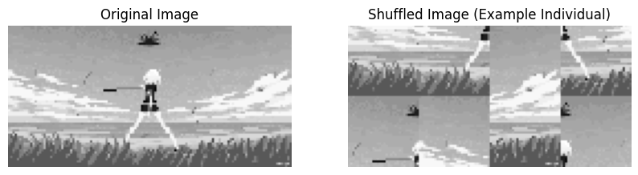

### 3.2 Fitness Function
- The next step in the genetic algorithm is to evaluate the fitness of each solution in the population. The fitness value will give us an idea of how close the solution is to the optimal solution. 

	1. *Fitness Calculation:* The fitness in this problem is calculated as the number of patches that are in the correct position. We compare the indices of the patches in the solution with the original indices of the patches. If the indices match, we increment the fitness value. This is a simple way to measure how close the solution is to the optimal solution. Below is the mathematical and python representation of the fitness calculation:

	$$
	\text{fitness} = \sum_{i=0}^{n-1} \delta(\text{individual}[i], \text{original\_indices}[i])\quad \text{and} \quad\delta(a, b) = 
	\begin{cases} 
	1 & \text{if } a = b \\
	0 & \text{otherwise}
	\end{cases}
	$$


	```python
		return sum(1 for i, idx in enumerate(individual) if idx == original_indices[i])
	```

	
- Below is a graphical representation of the fitness calculation of the initial population:

	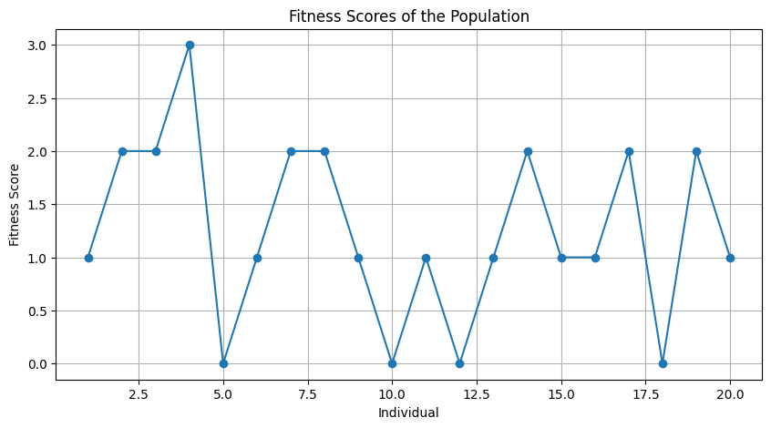


### 3.3 Selection Function
- The next step in the genetic algorithm is to select the best solutions to be parents of the next generation. We will use the tournament selection method to select the parents. 

	1. *Tournament Selection:* In tournament selection, we randomly select a subset of solutions from the population and choose the best solution from that subset. We repeat this process to select multiple parents until we have enough parents for the next generation. The tournament selection function is implemented as follows: 

		```python
		selected = []
		for _ in range(len(population)):
			tournament = random.sample(list(zip(population, fitness_scores)), k)
			winner = max(tournament, key=lambda x: x[1])
			selected.append(winner[0])

		return selected
		````

- Below is a Diagrammatic representation of the tournament selection process:

	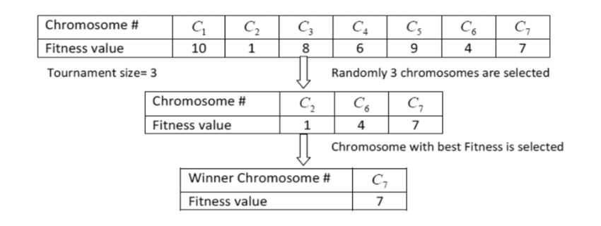

### 3.4 Crossover Function
- The next step in the genetic algorithm is to apply genetic operators such as crossover to create new solutions. Crossover is a process where we combine the genetic material of two parents to create new offspring. We will use the order crossover (OX) method to perform crossover.

	1. *Orger Crossover:* The order crossover method works by selecting a random segment of the parent genes and copying that segment to the children as follows:

		```python
		# Select a random segment of the parent genes
		size = len(parent1)
		start, end = sorted(random.sample(range(size), 2))


		# Create children with placeholder values
		child1 = [-1] * size
		child2 = [-1] * size

		# Copy the segment from parent1 to child1 and parent2 to child2
		child1[start:end] = parent1[start:end]
		child2[start:end] = parent2[start:end]


		```	

	2. *Fill Remaining Slots:* We then fill the remaining slots with the order of genes from the other parent by checking if the gene is already present in the child. If not, we add it to the child. This ensures that each gene is present only once in the child.

		```python
		# Fill the remaining slots with the order of genes from the other parent
		def fill_child(child, parent):
			current_pos = end
			for gene in parent:
				if gene not in child:
					if current_pos >= size:
						current_pos = 0
					child[current_pos] = gene
					current_pos += 1

		fill_child(child1, parent2)
		fill_child(child2, parent1)

		return child1, child2
		```
- Below is a Diagrammatic representation of the order crossover process:

	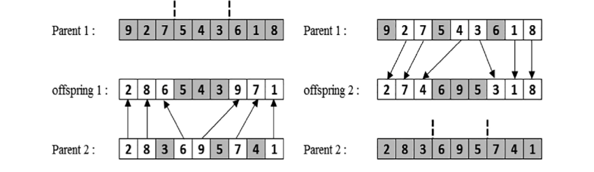

### 3.5 Mutation Function
- One of the final steps in the genetic algorithm is to apply mutation to create diversity in the population. Mutation is a process where we randomly change the genes of an individual to explore new solutions. Without mutation, the genetic algorithm may get stuck in local optima.

	1. *Swap Mutation:* We will use the swap mutation method, where we randomly select two genes in the individual and swap their positions. This introduces randomness in the population and helps in exploring new solutions. 

		```python
		mutated = individual[:]
		for i in range(len(mutated)):
			if random.random() < mutation_rate:
				j = random.randint(0, len(mutated) - 1)
				mutated[i], mutated[j] = mutated[j], mutated[i]  # Swap genes

		return mutated


		```
	
	2. *Mutation Rate:* The mutation rate is a parameter that controls the probability of mutation. A higher mutation rate increases the chances of mutation, leading to more exploration in the search space. 

## 4. Genetic Algorithm Implementation
### 4.1 Evolve Population Function
- Now that we have defined the various components of the genetic algorithm, we can put them together to create the genetic algorithm for the image puzzle problem. For this purpose we will have a *evolve_population()* function that will make our job a lot easier.

	1. *First Part:* The first part of the function involves selecting the best solutions from the population using tournament selection and elitism. Tournament selection is used to select the parents for the next generation, and elitism is used to carry over the best individuals from the current generation to the next generation.

		```python
		# Step 1: Selection with tournament selection
		selected_population = tournament_selection(population, fitness_scores)

		# Step 2: Elitism - carry over the best individuals
		indices = range(len(fitness_scores))
		sorted_indices = sorted(indices, key=lambda i: fitness_scores[i], reverse=True)
		elite_indices = sorted_indices[:elitism_size]


		new_population = [population[i] for i in elite_indices]


		```	

	2. *Second Part:* The second part of the function involves performing crossover and mutation to create new solutions. We use the order crossover method to create offspring from the selected parents and apply swap mutation to introduce diversity in the population based on the crossover rate and mutation rate.

		```python
		# Step 3: Crossover
		while len(new_population) < len(population):
			parent1, parent2 = random.sample(selected_population, 2)
			if random.random() < crossover_rate:
				child1, child2 = order_crossover(parent1, parent2)
			else:
				child1, child2 = parent1, parent2
				
			new_population.extend([child1, child2])
		
		# Step 4: Mutation
		new_population = [swap_mutation(individual, mutation_rate) for individual in new_population]
		
		return new_population
		```

### 4.2 Usage of Everything
- After the function definitions, the time 

	1. *Initialization:* We first initialize the values to use on our functions. What these mean is there will be 20 individuals in the population, the genetic algorithm will run for a maximum of 1000 generations, with a probability of 80% for crossover and 10% for mutation.

		```python
		population_size = 20
		num_generations = 1000
		crossover_rate = 0.8
		mutation_rate = 0.1
		```

	2. *Population Generation:* We then create a loop to evolve the population. We calculate the fitness scores for the population. If the best fitness is equal to the number of patches, we have found the solution, and we break out of the loop. Otherwise, we evolve the population using the evolve_population function. The visualization of the population is done here.

		```python
		# Evolve the population
		for generation in range(num_generations):
			# Calculate fitness scores for the population
			fitness_scores = [calculate_fitness(ind, list(range(num_patches))) for ind in population]

			# Print best fitness in the current generation
			best_fitness = max(fitness_scores)

			if best_fitness == num_patches:
				print(f"Solution found in Generation {generation + 1}")
				visualize_population(population, patches, patch_size, generation, fitness_scores)
				break

			# Evolve the population
			population = evolve_population(population, fitness_scores, crossover_rate, mutation_rate)
		```

# 5. Best Images of Each Generation
- Below are the images of the best individuals in each generation for a simple run of the algorithm. 

| Gen 1 | Gen 2 | Gen 3 |
|-------|-------|-------|
|  | 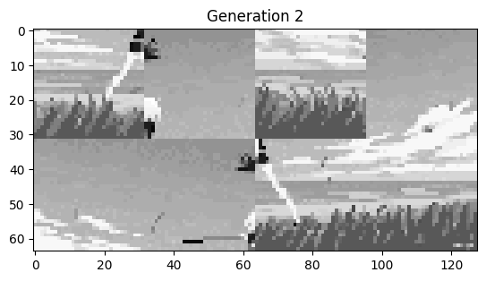 | 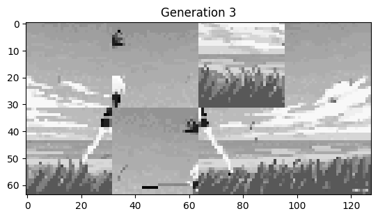 |

| Gen 4 | Gen 5 | Gen 6 |
|-------|-------|-------|
| 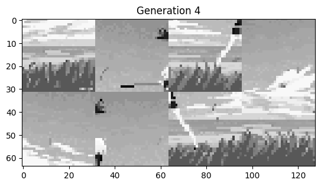 | 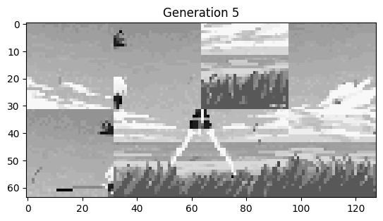 | 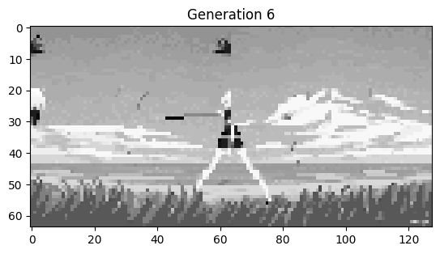 |

| Gen 7 | Gen 8 | Gen 9 |
|-------|-------|-------|
| 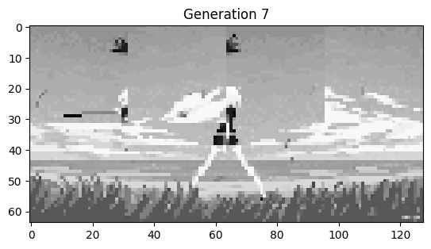 | 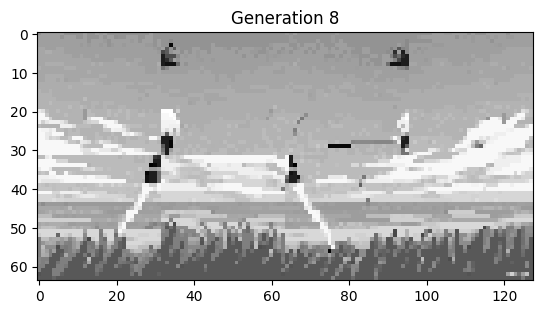 |  |

| Gen 10 | Gen 11 | Gen 12 |
|--------|--------|--------|
|  |  |  |

| Gen 13 | Gen 14 | Gen 15 |
|--------|--------|--------|
|  | 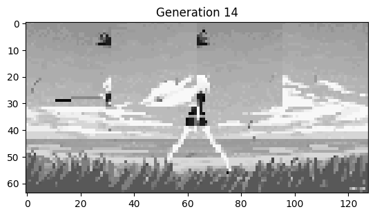 | 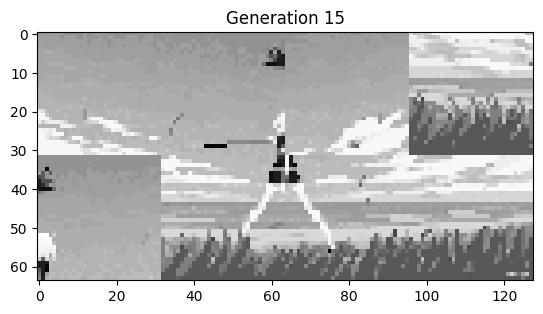 |
| Gen 16 | Gen 17 | Gen 18 |
|--------|--------|--------|
|  |  | 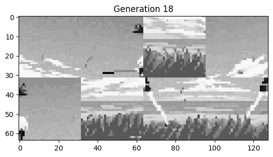 |

| Gen 19 | Gen 20 | Gen 21 (Final One) |
|--------|--------|--------|
| 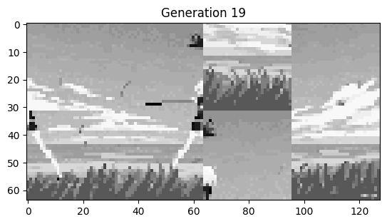 | 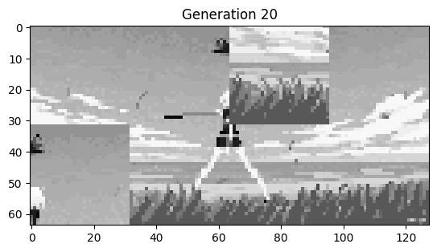 | 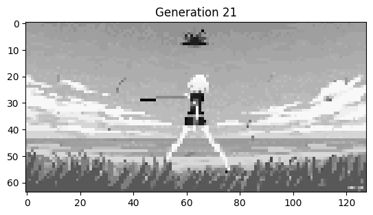 |


